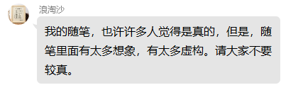

# 松典

# 目录

# 已发表期刊文章

[踩河蚌](%E8%B8%A9%E6%B2%B3%E8%9A%8C.md)

# 作品集

## 诗集

[《蹩脚诗吟》](%E3%80%8A%E8%B9%A9%E8%84%9A%E8%AF%97%E5%90%9F%E3%80%8B.md)

# 精选集

[《象牙塔》十大名篇](%E3%80%8A%E8%B1%A1%E7%89%99%E5%A1%94%E3%80%8B%E5%8D%81%E5%A4%A7%E5%90%8D%E7%AF%87.md)

# 小说

为方便阅读，故事前给出了剧情梗概，可以据此决定是否阅读。

支持田松作品，请到晋江文学城搜索”木公匠人“。

[木公匠人 的专栏:未名居_晋江文学城|晋江原创网](http://www.jjwxc.net/oneauthor.php?authorid=2149875)

[小说](%E5%B0%8F%E8%AF%B4.csv)

# 随笔集

[象牙塔（初稿）](%E8%B1%A1%E7%89%99%E5%A1%94%EF%BC%88%E5%88%9D%E7%A8%BF%EF%BC%89.md)

[象牙塔（知乎版）](%E8%B1%A1%E7%89%99%E5%A1%94%EF%BC%88%E7%9F%A5%E4%B9%8E%E7%89%88%EF%BC%89.md)

# 长篇小说

[大湾河边](%E5%A4%A7%E6%B9%BE%E6%B2%B3%E8%BE%B9.md)

# 散文集

[美丽的山村](%E7%BE%8E%E4%B8%BD%E7%9A%84%E5%B1%B1%E6%9D%91.md)

# 随笔&散文

[随笔](%E9%9A%8F%E7%AC%94.csv)

# 书信

[告别书信集](%E5%91%8A%E5%88%AB%E4%B9%A6%E4%BF%A1%E9%9B%86.csv)

# 诗歌

[田松诗歌精选](%E7%94%B0%E6%9D%BE%E8%AF%97%E6%AD%8C%E7%B2%BE%E9%80%89.md)

[田松诗歌集](%E7%94%B0%E6%9D%BE%E8%AF%97%E6%AD%8C%E9%9B%86.csv)

# 信笺&手稿

[手稿](%E6%89%8B%E7%A8%BF.csv)

# 知乎回答

[在荒山里如何认路走出大山](%E5%9C%A8%E8%8D%92%E5%B1%B1%E9%87%8C%E5%A6%82%E4%BD%95%E8%AE%A4%E8%B7%AF%E8%B5%B0%E5%87%BA%E5%A4%A7%E5%B1%B1.md)

[什么是长大](%E4%BB%80%E4%B9%88%E6%98%AF%E9%95%BF%E5%A4%A7.md)