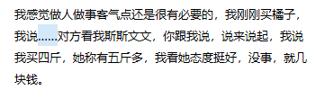

# 松语速成指南

# 内容

## 肯定别人

正常版本：**你说得对**

重田松风版本：**你认知很高**

## 否定别人

**你认知太低，我都不想理**。

## 表示不满

**已踢**

**滚远**

**想滚了是吧**

## 打招呼

**你好哇**

## 找不到合适的词来形容

可以用**那啥**或省略号（**……**）来代替，如：

  
  

（上面一句是群友模仿，并非田松原话）

## 遇到挫折如何自我安慰

### 阿Q法

也叫“横竖不亏”法。即思考失败或者挫折可以有什么正面意义，如果实在没有正面意义，就说失败可以成为写作素材。最终，以一句“反正，我横竖不亏”作为总结。

示例：

### 转移话题法

遇到挫折，或者与人争论失败，可以及时转移话题，例如谈论自己的收入。

示例：

> 在贵阳，一个月一万
还是很难的
> 

此法也可以日常使用以提升自信心。

### 无视法

### 李代桃僵法

## 与人辩论的方法

### 不服法

当别人说的很有道理的时候，可以承认别人说的话，之后加一句：“**但是，我不服**。”

当自认为自己的理论无懈可击，可以在后面加一句：“**谁不服**？”

如果真的有人不服，可以回一句：“**你不服，管老子屁事**”

### 降低底线法

有句话叫“只要我没有道德就没人能道德绑架我”，“只要我没有道德，就没人可以站在道德制高点上指责我”。

例如：

这样即使说的话价值观有问题，因为我是道德败坏的人，就很正常。

### 年少轻狂法

适用于别人翻旧账时，属于认怂，脸皮薄不建议使用。

# 形式

## 松体

日常说话，一定要换行，如：

## 松假字

在输入的时候，要有田松式的错别字，称为松假字。

松假字最好不要刻意，如果在输入时不小心输错了，不去修改，就是最自然的松假字。

但是一般人的认知达不到松的水平，因此打出的松假字没有松的效果。

常见松假字如：

**杠杠**（杠杆）

**何坤**（和珅）

**屏幕**（屏蔽）

**咱啦**（咋啦）

示例如下：

  
  

# 模板

## 醉酒体

[https://scaryken.github.io/SongFormatter/drunk_body.html](https://scaryken.github.io/SongFormatter/drunk_body.html)

## 已踢体

[https://scaryken.github.io/SongFormatter/kicked_body.html](https://scaryken.github.io/SongFormatter/kicked_body.html)

## 烂人体

**渣渣辉**，我已有收到举报，他就是个烂人，此群永久性禁止。
